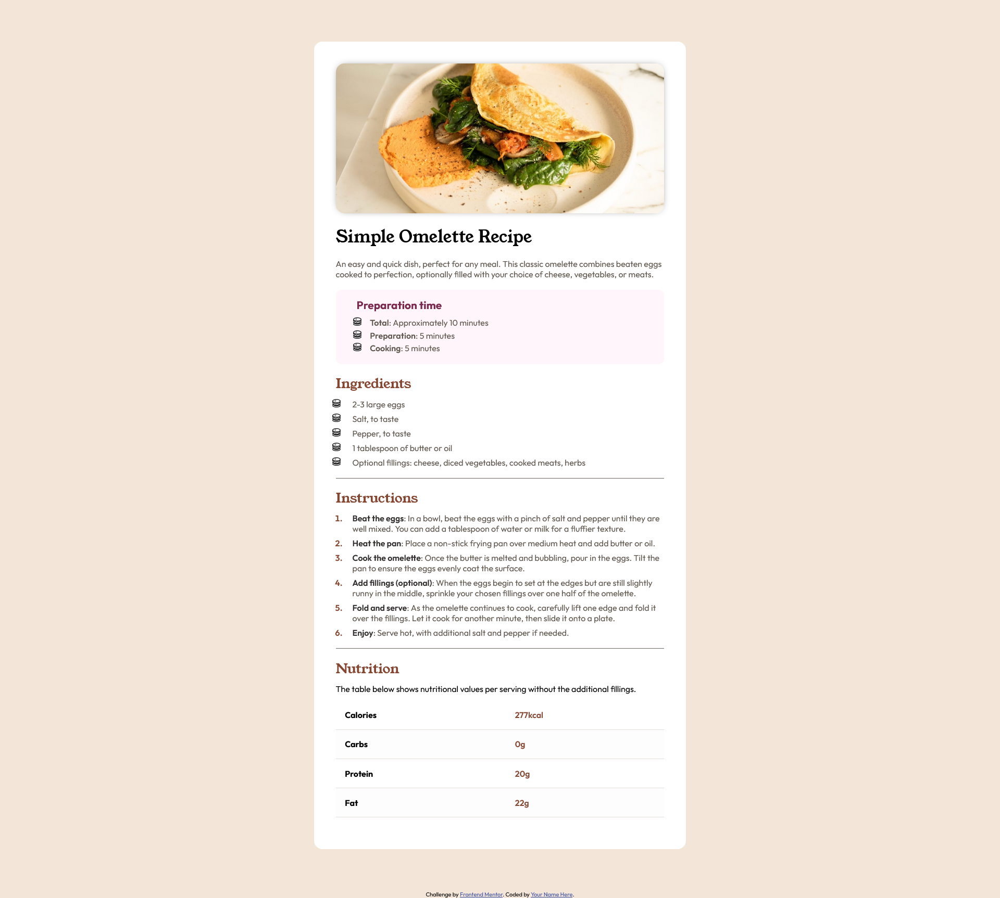
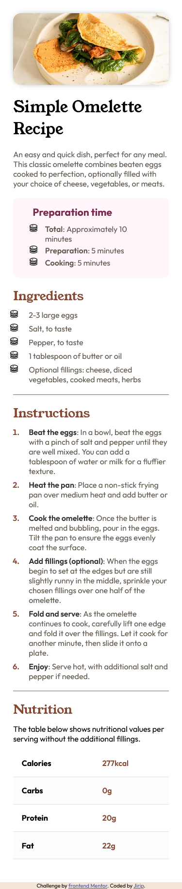

# Frontend Mentor - Recipe page solution

This is a solution to the [Recipe page challenge on Frontend Mentor](https://www.frontendmentor.io/challenges/recipe-page-KiTsR8QQKm). Frontend Mentor challenges help you improve your coding skills by building realistic projects. 

## Table of contents

- [Overview](#overview)
  - [The challenge](#the-challenge)
  - [Screenshot](#screenshot)
  - [Links](#links)
  - [Built with](#built-with)
  - [Useful resources](#useful-resources)

## Overview

### The challenge

Users should be able to:

- View the optimal layout for the interface depending on their device's screen size
- See hover and focus states for all interactive elements on the page

### Screenshot

 

### Links

- Solution URL: [Solution](https://jirip1.github.io/Frontendmentor/recipe-page) 

### Built with

- Semantic HTML5 markup
- CSS custom properties
- CSS Grid
- CSS Flex

### Useful resources

- [Kevin Powell](https://www.youtube.com/@KevinPowell)
- [MDN](https://developer.mozilla.org/en-US/)
